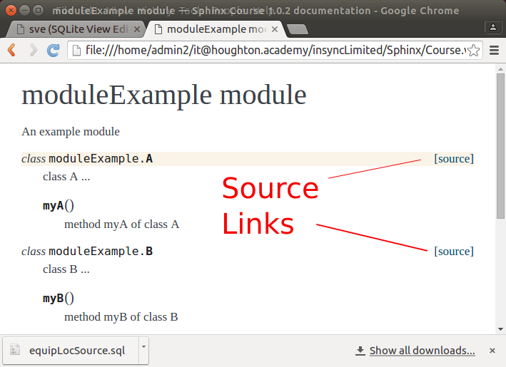

.. _AddingPython:

**************************
Adding Python Code
**************************

.. index:: 
   single: Python; adding to Sphinx
   single: Sphinx; including Python code

We've already set up a director, pcode, for our python code. Now let's get Sphinx showing up the documentation that is in our Python code.

.. index::
   triple: conf.py; extension; autodoc
   single: conf.py; introduced

Update conf.py
====================

Python is different that normal (.rst files) or text files, such as the SQL files we added. For Python code we need to use the autodoc extension. An extension is additional logic, including new directives, added to Sphinx. Let's assume we can't remember if we added this extension when ran sphinx-quickstart. We can see if we loaded the extension by looking at conf.py in the source directory.

conf.py is very important to the building of your site. This is the configuration file that sphinx-build looks at to determine how to build your site. We will find that we can make some nice changes to our site by changing conf.py. 

* Open source/conf.py and search for extension until you find::

   extensions = [
       'sphinx.ext.autodoc',
       'sphinx.ext.doctest',
       'sphinx.ext.intersphinx',
       'sphinx.ext.todo',
   ]

This Python statement list autodoc as one of the extenions we want included in our builds. So we know we have completed that first step of preparing to add python code. 

.. index::
   pair: sys.path.insert; conf.py
   pair: code location; conf.py

.. _GiveSysPath:

Give sys.path
---------------------

The next step is to tell Sphinx where the python code we want evaluated is located. This is also done in conf.py.

* Make sure you know the full path to your code. One way to do this is to find it in your file browser. Typically the browser shows it as icons. You can switch to characters. One common way is to press Ctrl+L. 
* In conf.py search for `sys.path.insert`. 
* You will see::

   sys.path.insert(0, os.path.abspath('.'))

* change it to be the following with you path in the place of the one we show in this example::

   sys.path.insert(0,'/home/user/Sphinx/source/Code')

You will see why we used a captical C rather than lowercase soon. However, you can use any case you want. Just be sure you have the correct case if you using Linux.

* Be sure to save your changes to conf.py

.. index::
   pair: error; "ImportError: No module named ... WARNING: autodoc: failed to import module u'"

Common error
++++++++++++++

It is common to get the error when adding your Python code: 

"ImportError: No module named ... WARNING: autodoc: failed to import module u'"

where the ... is filled in with the name of your file.

This is caused by forgetting to include the location of the code in teh sys.path as explained :ref:`above <GiveSysPath>`. 

.. termx:: Puma

   Puma is a genus in Felidae that contains the cougar (also known as the puma, among other names) and the jaguarundi, and may also include several poorly known Old World fossil representatives (for example, Puma pardoides, or "Owen's panther," a large cougar-like cat of Eurasia's Pliocene)

.. index::
   single: Python; creating rst files with sphinx-apidoc
   single: sphinx-apidoc
   single: apidoc

Creating the supporting .rst files
========================================

To get started with let's put some code into your Code directory. 

* Copy the .py files from our Code folder into yours. 

Now we need to create the .rst files that will allow us to see the code. There is a program to help us with this call sphinx-apidoc. 

* run the following::

   sphinx-apidoc -o source/Code source/Code -f 

This assumes you named the directory with your python code as Code. If not, replace Code with what you used. 

The -o means we are going to give the output directory for the generated output, which we gave source/Code.

The second directory (again source/Code) is the location of your code. 

The -f means to replace existing files with the new output. You do not need this the first time you run, but it is a good habit when you first start so you make sure you are getting the most recent output.

Look in the Code directory. Check out the files in the folder. What is the modules.rst file?

modules.rst builds the TOC for us. This is automatically generated by sphinx-apidoc. What do you need to do to include our code in the initial table of contents?

* Add modules.rst to the index.rst.

* rebuild your site and then look code also check out the index and see the code is included there. 

Do you see why we used a captical C yet? 

sphinx-apidoc uses the name of the folder to build modules.rst including the title for the page. When the toctree is built for index.rst the name of the folder is used. Hence, if we use a capital C it goes nicely with the rest of our TOC. 

|pencil| Assume you have 100 .py files and you do not want the directory cluttered with the .rst files. Experiment with putting the .rst files in another folder. [#f1]_

You can read more about sphinx-apidoc on the :ref:`sld:invocation` page. 

Seeing your code
========================

* Add the viewcode extension to conf.py such as:: 

   extensions = [
       'sphinx.ext.autodoc',
       'sphinx.ext.doctest',
       'sphinx.ext.intersphinx',
       'sphinx.ext.todo',
       'sphinx.ext.viewcode',
   ]

* rebuild your site and look at your code.

You should now see a link that let's you see your source code and another that takes you back to the doc.

What are the pyc files?
==========================

After you run sphinx-apidoc you will notice that there are .pyc files for all you .py. That is because sphinx-apidoc compiles your code which results in compliled code, hence the c. For this reason make sure your scripts (as opposed to library modules) protect their main routine by using a ``if __name__ == '__main__'`` condition.

Python directives
======================

There are very helpful directives to use with your Python code. Read about domain and also autodoc in the :ref:`Sphinx documentation <sld:contents>`. 

.. rubric:: Footnotes

.. [#f1] We put a directory source/coderst. This is where we had sphinx-apicode place its output. We also fixed index.rst to have modules be in the coderst directory. We did not put a folder under code because when we start to use images we want them in the same relative location from our code as they are from our other .rst files. 

.. |pencil| image:: ../images/Pencil.png
          :align: middle
          :alt: Try It
          :width: 38 px
