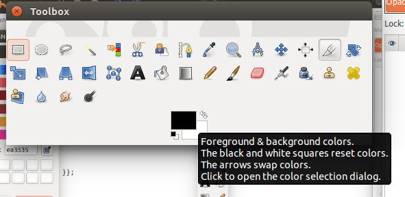
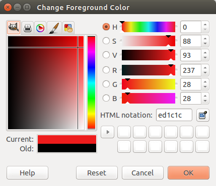

.. _ChangingTheme:

*************************
Changing the theme
*************************

.. definition:: Manx cat

   The Manx cat (/ˈmæŋks/, in earlier times often spelled Manks), is a breed of domestic cat (Felis catus) originating on the Isle of Man, with a naturally occurring mutation that shortens the tail

.. index::
   pair: conf.py; theme
   pair: theme; changing the way the site looks

Now to have some fun. Let's change the entire way your site looks with just a couple of keystrokes.

* Find the `Options for HTML output` section of conf.py.
* Place a comment sign (#) in the first column of the `html_theme = 'alabaster'` line.
* Add the following line, or if it already exists, then remove the comment mark. Remember, Python works on indents so keep the indentation of the code the same::

   html_theme = 'classic'

* Change the `html_theme_options` line to be::

   html_theme_options = {
       "rightsidebar": "true",
       "relbarbgcolor": "black"
   }

* Rebuild your site and see the effect.

Making our own theme
========================

.. index::
   triple: path; backslash; Windows

The first thing we need to do is to fine out where Sphinx stores is themes, which are .css (cascading style sheets) files. We can find it by using our file browser and search for classic.css. We found it in two locations. One is with the local Sphinx documentation we include with the course. The other was found in::

   /usr/local/lib/python2.7/dist-packages/sphinx/themes

.. Note::

   This material is written for Linux. If you are using Windows, make sure you use the backslash \\. 

We are going to need privileges to work with these directories and files. 

* Open a terminal.
* Change to the directory where the themes are located and issue::

   sudo cp -r classic ten3

You will be asked for your password. If this is a school system, you will need your teacher to enter the password. 

The cp command made a copy of the classic directory and named it ten3. The -r option made the command recursive incase there are sub-directories. 

* Change the theme in conf.py to ten3

.. Note:: 
   We will use the name ten3.css_t in our examples. However, you use the name you've choosen for your style sheet. 

Now we have a theme we can play with and change as we like. We need to change the permissions on the files and directory in the directory we just made so we can edit them. The file we want to work on is the subfolder static. Issue the following command::

    > sudo chmod 777 static
    > sudo chmod 777 theme.conf
    > cd ..
    > sudo chmod 777 ten3

Do the following::

   > cd ten3/static
   > sudo mv classic.css_t ten3.css_t
   > sudo chmod 777 ten3.css_t

The mv (move) command basically renamed the file for us. Then we changed the permissions so now we can edit the ten3.css_t file. We are now ready to start making changes and see what that does to our site. 

* edit theme.conf and change the stylesheet to ten3.
* edit ten3.css_t and find code that looks like::

   body {
       font-family: {{ theme_bodyfont }};
       font-size: 100%;
       background-color: {{ theme_footerbgcolor }};
       color: #000;
       margin: 0;
       padding: 0;
   }

* Change the 100% font-size to %200 
* Open the index.rst and type in a space and then delete and then save the file. 

.. Note::

   The changes we made to the styles will not force a rebuild, but changing a .rst file will make sure a rebuild happens. 

* Rebuild your site and see what happened.

|pencil| Now play with colors and sizes in your new style sheet. Rebuilding to see the effect. Note, if you want to find out the hex numbers for colors open GIMP to the following.

* If the tool box is not open, use Windows > New Toolbox and then click on the forground/background option.

* Click on a color and you'll see the HTML notation which is the hex number for the color that was clicked on. It is ed1c1c in the example below.

* Open ten3.css_t for editting and change the opening links to something like::

   /*
    * ten3.css_t
    * ~~~~~~~~~~~~~
    *
    * TEN3 stylesheet -- default theme.
    *
    * Adapted from the Sphinx stylesheet,
    * :copyright: Copyright 2007-2015 by the Sphinx team, see AUTHORS.
    * :license: BSD, see LICENSE for details.
    *
    */

Notice, we make it clear that we got this material from Sphinx. The BSD licences allows us to do this. We do not change the license because part of using BSD materials is to keep it BSD, that is open for others to use.  

Adding a logo
================

* Find a small graphic you'd like to use as a logo. 
* In the source directory add a sub-directory named images.
* Put your logo in the images directory.
* Edit the conf.py and search for ``html_logo`` and change ``None`` to ``'images/TEN3Logo.gif'`` replacing TEN3Logo.gif to the name of your logo. 
* Rebuilt the site. 

|pencil| Pick another theme, such as sphinxdoc, make a copy and customize it.

.. |pencil| image:: ../images/Pencil.png
          :align: middle
          :alt: Try It
          :width: 38 px
