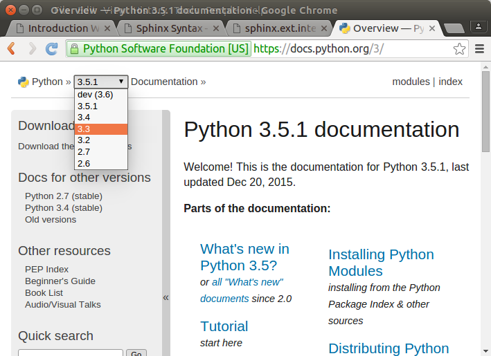

.. _Introduction:

**************************
Introduction
**************************

You are learning to program. You write few lines of code and you able to make the computer do all kinds of cools things, bring windows to life, making decisions, having your logic work on the computer. Why do you need to learn to document?

Or you are learning networking. You change a few things on the server and the next thing you know an entire new website is available to the world. You need to learn the server commands, but why do you need to learn to document?

Any time you develop a system that is more than just a toy, you need to document it so it can continue to function. The documentation isn't just for your users. There will be times when good documentation will save you because of things you forgot about your system. 

Gratefully there is a documentation system that programmers actually enjoy. It is called Sphinx. They like it because it is like a programming language itself. It also reduces the need of writing a program in one file and writing its documentation elsewhere. You are able to put the documentation right in the code so you do not need to think about writing it somewhere else. Sphinx uses text files so it is able to have version control like a programming project. Hence, you can easily refer to the documentation for a given version. If you access python.org online and go to their online documentaiton for Python 3 (https://docs.python.org/3/), you will see:

There is a pulled down menu where you can pick the version of documentation you want to read. This allows programmers to look at the version of the language they are using rather than whatever was put last on the site. 

I [#f1]_ have taken documentation seriously throughout my career and it has paid off. Concerning comments in code, many years ago I wrote the software that could read the data from a scanner. The programmer that followed me had to port (move) that software to a new system. He told me how my documentation made that an easy task. Considering a full system and user documentation, I had the privilege of writing an international personnel system in the late 1980s. The database I used was not all that powerful, so I had to supplement it with some C programs. I was also under time pressure, so I wasn't completely satisfied with the system. In fact, if I would have been grading myself I would have given me a B-. But the users loved the system. In fact, more than one programmer tried to replace that system with better databases than I used but their work was rejected. It was not until the next millennium that the system was replaced. Why did the users refuse the new systems? Because the documentation was not good enough. They understood by B- system because of the documentation. 

The course is about explore Sphinx in order to learn how to use it for documentation. You'll learn it is powerful enought to build sites and even courses. 

Organizing
=============

When I was in high school the big push in English class was that you need to make an outline before you start writing a story. That has always been hard for me because when I write a story I'm never sure what is going to happen. It just unfolds as I work on it. This is not uncommon for some authors because the story is a living thing to them. It unfolds as they write it. 

Programmers, including me when I program, do not tend to be that way. They want to accomplish something with the computer and if they know the criteria well and have a good handle on a programming language to use, they make themselves an outline and then work on getting it done. However, they tend to let the documentation go to the end because they are not sure exactly how it is going to work out. However, with Sphinx you can document as you go along, thinking of them as notes to help you with your design. Then when you are finished the documentation is already well on its way. 

.. index::
   pair: documentation; additional
   pair: additional; reference materials
   pair: reference; materials

Documentation
=================

The Sphinx documentation is included with the course. We link directly to the documentation. You can also find directly access the files from the documentation folder. The Sphinx documentation links to the Internet will not work if you are not connected to to the Internet, but there is plenty of information on Sphinx in the documentaiton. We've also included :ref:`morerst` which is the site the Sphinx documentation often references. The :ref:`morerst` pages also have some links to the Internet. Also some of their internal links do not work because of the different way those pages were structured. As you work in this course, you'll be able to determine how to find those internal references. 

.. include:: ../supporting/HyperlinkHandling.txt

.. comment: using include is a potential security risk. Decide if you want to keep using this?

|

.. Note:: 

   Teacher, the following paragraph should be simply be a link saying **Sphinx documentation contents**. If it does, then this course is ready to use. However, if it just says **contents** or the link doesn't work, then the file location set for intersphinx_mapping in the conf.py is wrong. You need to change the file location and rebuild the course. 

   :ref:`sld:contents`

.. index::
   pair: course; description

Course
============

If you are offering this as a course, you should cover everything in the :ref:`documentation` table of contents. The :ref:`sld:contents` and the :ref:`morerst` section are for reference and to do assignments given in the course, but they are not meant to be read through during the course. These references also are helpful as the student uses Sphinx in other courses. There is enough reference material with this course to make one quite profecient with Sphinx and reStructuredText. 

.. todo::
   JennyBeth, in addition to ideas you have for this chapter. Would you be able to this site http://write-the-docs.readthedocs.org/ (which sphinx recommends) and see if there things we should add. This could be a book on this topic, but I just want some ideas here. However, if you have an idea of something more we could add let's consider it.

.. rubric:: Footnotes

.. [#f1] Dr. Anthony "Baba Computer" Petrillo is writing this section.

.. warning:: Keep in mind, Sphinx is like a programming language, and as such, it is very particular with spacing and punctuation. If you put an extra space in, the code may not work. Or some commands use a trailing colon : and others two colons :: and if you get it wrong they will not work. You need to be as particular with this as a programming language. 

